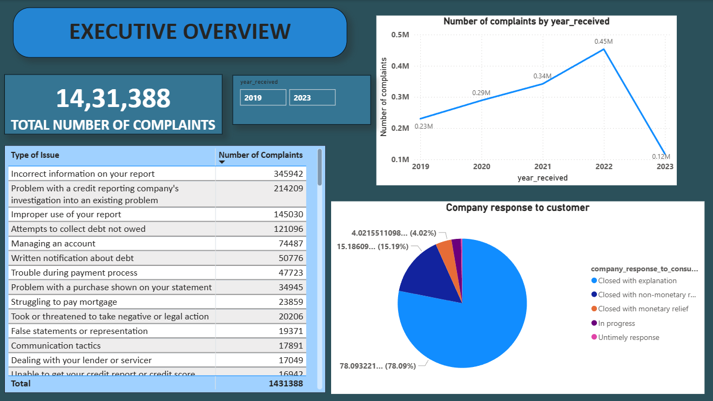
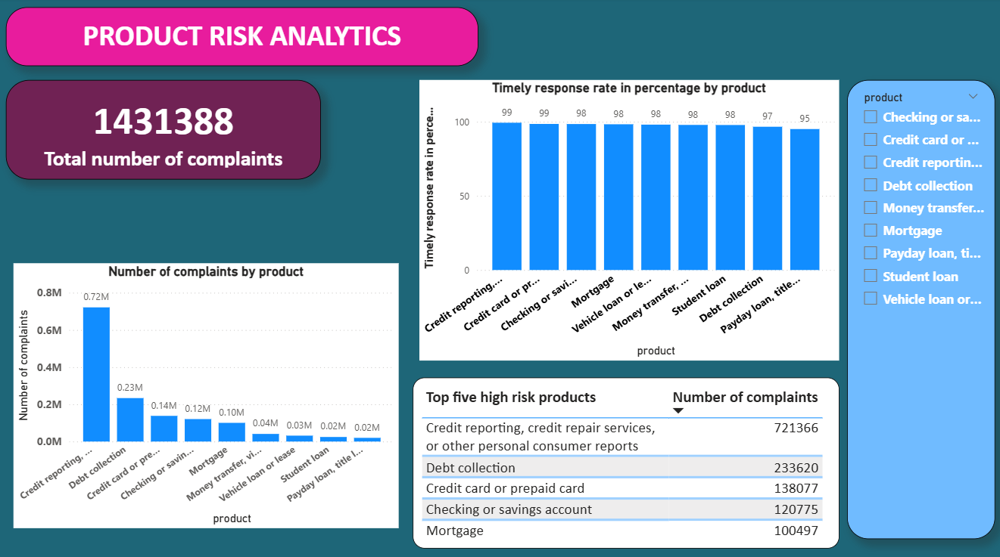
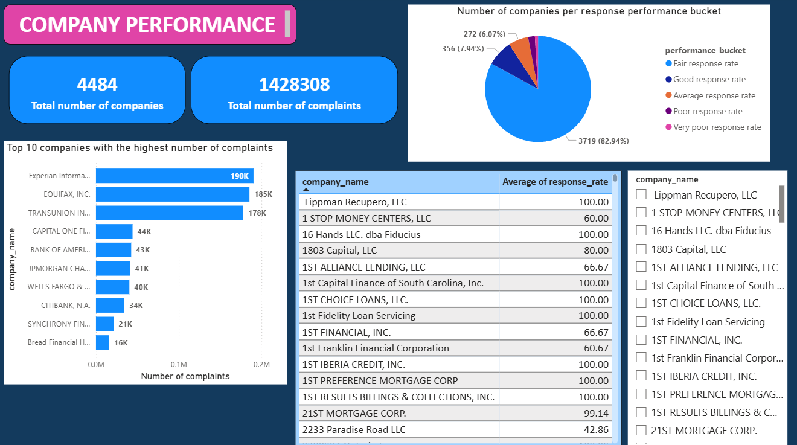

# CONSUMER FINANCIAL COMPLAINTS AND RESPONSE ANALYTICS

## Project Overview
This project analyzes consumer complaints filed with the Consumer Financial Protection Bureau (CFPB) to evaluate operational performance, product risk, and company responsiveness within the U.S. financial services industry.

The objective is to transform large-scale, raw complaint data into business-ready KPIs and executive dashboards that support risk monitoring, compliance oversight, and decision-making.

## Business Problem

Financial institutions face significant regulatory, reputational, and operational risk when:
Complaint volumes increase rapidly, 
Complaints concentrate around specific products or services,
Companies fail to respond to complaints in a timely manner.

Regulators closely monitor complaint trends, and persistent issues may trigger audits or enforcement actions. Executives and risk teams therefore need high-level visibility, not raw data.

This project addresses the following key business questions:

  Which financial products generate the highest number of complaints?
  How have complaint volumes changed over time?
  What are the most common consumer-reported issues?
  How effectively do companies respond to complaints?
  Which companies may pose potential operational or compliance risk?

## Why This Matters

Consumer complaints are a leading risk indicator in financial services.
Timely response is a core compliance KPI.
Product-level complaint patterns help identify high-risk offerings.
Company-level performance benchmarking supports operational oversight.

## Data Source

CFPB Consumer Complaints Database.
Source: Google BigQuery (public dataset).
Time period analyzed: 2019–2023.
Records analyzed: 1.4M+ complaints.

## Data Preprocessing & Feature Engineering

The raw dataset required several preprocessing steps before analysis:

### Data Cleaning

Removed duplicate complaint records.
Handled missing values in many fields.
Standardized column data types.
Converted complaint receipt dates to datetime format.

### Feature Engineering

Extracted year and month from complaint receipt date.
Created derived fields for time-based trend analysis.

Cleaned and processed datasets were saved as intermediate KPI-ready tables for downstream analysis and visualization.

## KPI Design and Tables created
KPIs were designed with a business-first approach, focusing on interpretability and decision relevance.

### Core KPI tables
Complaints Over Time:
Tracks complaint trends by year and month

Complaints by Product:
Identifies high-risk financial products

Issues Count:
Highlights the most common consumer-reported problems

Complaint Outcome Distribution:
Shows how complaints are resolved (explanation, monetary relief, etc.)

Timely Response Rate by Product:
Measures compliance performance at the product level

Timely Response Rate by Company (volume-filtered):
Benchmarks company responsiveness while excluding low-volume entities to avoid misleading rates

Company Complaint Volume:
Identifies institutions with the highest complaint exposure

## Dashboards

The analysis is visualized using Power BI, with three interactive pages:

1. Executive Overview:
   Overall complaint volume and trends
   Top consumer issues
   Company response outcomes
   

2. Product Risk Analytics
   Complaint distribution by product
   Timely response rate by product
   High-risk products
   

3. Company Performance
   Top companies by complaint volume
   Response quality benchmarking
   

## Key Insights
- Complaint volumes peaked in 2022 and declined in 2023 (likely due to partial-year data)
- Credit reporting-related products generate the highest complaints.
- Majority of complaints are closed with explanation rather than monetary relief.
- Timely response rates are generally high, but performance varies by company and product.

## Tech Stack

Python (Pandas, NumPy, Matplotlib),
Google BigQuery,
Power BI,
VS Code,
Jupyter Notebook